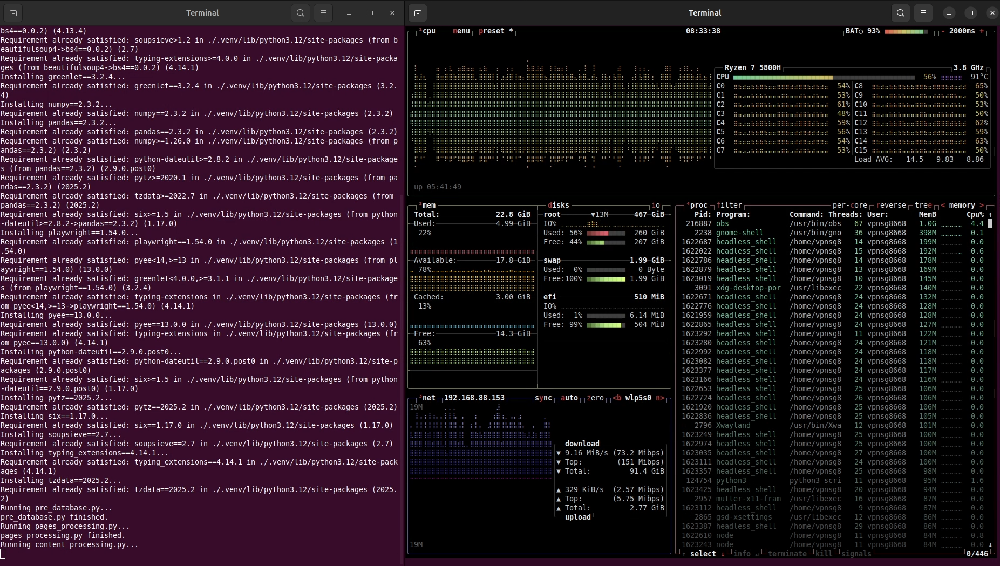

# VNEconomy Fulltext Crawler

## 1. Tổng quan dự án

Dự án **VNEconomy Fulltext Crawler** được xây dựng để tự động **crawl dữ liệu tin tức từ trang VNEconomy**, lưu trữ:

1. **Danh mục (categories)**
2. **Link bài viết (links)**
3. **Nội dung fulltext bài viết (contents)**

vào **SQLite database (`vneconomy_news.db`)** và các CSV hỗ trợ. Mục tiêu là **tích hợp dữ liệu toàn diện, phục vụ phân tích, tìm kiếm, hoặc nghiên cứu**.

Pipeline được thiết kế **có log minh bạch, tường minh**, có thể chạy **tự động toàn bộ bằng 1 lệnh**, đồng thời có thể chạy từng bước riêng biệt.

---

## 2. Cấu trúc thư mục

```
├── content_data
│   └── bao-hiem-tai-chinh
│       ├── 2021-05-25-18-15-vu-sao-ke-tai-khoan-cua-hoai-linh-bi-phat-tan-mb-noi-gi.txt
│       └── 2021-10-04-07-44-vi-sao-van-chua-het-than-phien-ve-cac-goi-giai-cuu.txt
├── database
│   └── vneconomy_news.db
├── logs
│   ├── content_processing_log.txt
│   ├── pages_processing_log.txt
│   ├── post_database_log.txt
│   ├── pre_database_log.txt
│   └── run_log.txt
├── paper_links
│   └── thuong_hieu_xanh.csv
├── README.md
├── requirements.txt
├── run_all.sh
├── scripts
│   ├── content_processing.py
│   ├── pages_processing.py
│   ├── post_database.py
│   ├── pre_database.py
│   └── init_database.py
│   └── reset_database.py
└── tmp
    ├── categories.csv
    ├── fresh_links
    ├── paper_html
    └── tables_info.txt
```

### Giải thích:

* **content\_data/**: lưu các bài viết đã crawl theo category.
* **database/**: chứa file SQLite `vneconomy_news.db`.
* **logs/**: ghi log chi tiết khi chạy pipeline và từng script.
* **paper\_links/**: lưu CSV các link bài viết theo category.
* **scripts/**: chứa các script Python thực hiện từng bước pipeline.
* **tmp/**: folder tạm, chứa file CSV categories, fresh links và HTML tạm thời.

---

## 3. Quy trình xử lý dữ liệu

Pipeline gồm **5 bước chính**, được tự động chạy bởi `run_all.sh`:

1. **init_database.py**

    - **Mục đích:** Khởi tạo database `vneconomy_news.db` trong thư mục `database/` nếu chưa tồn tại.

    - **Tạo các table cơ bản nếu chưa có:**
      - `categories` (id, category_link)
      - `links` (idx, category_index, paper_link)
      - `contents` (idx, category_index, publish_date, title, text)

    - **Import dữ liệu** từ `tmp/categories.csv` vào table `categories` (nếu file tồn tại).

    - **Log tường minh từng bước ra terminal**, bao gồm:
      - Kiểm tra folder database
      - Tạo database nếu chưa có
      - Tạo table từng bước
      - Số bản ghi được import từ CSV hoặc cảnh báo nếu CSV không tồn tại

    - **Lưu ý:** Không xóa dữ liệu cũ, chỉ dùng `INSERT OR IGNORE` để tránh trùng lặp.

2. **pre\_database.py**

   * Chuẩn bị CSV `categories.csv` từ table `categories`.
   * Dump thông tin các table vào `tmp/tables_info.txt`.
   * Log tường minh từng bước ra terminal và file `logs/pre_database_log.txt`.

3. **pages\_processing.py**

   * Crawl **link bài viết** theo từng category.
   * Sử dụng **20 thread** đồng thời (I/O-bound).
   * Lưu link mới vào `tmp/fresh_links`.
   * Log ra terminal và `logs/pages_processing_log.txt`.

4. **content\_processing.py**

   * Crawl **fulltext bài viết** từ các link trong `tmp/fresh_links`.
   * Sử dụng **20 thread** đồng thời.
   * Lưu file txt vào `content_data/fresh_{category}` tạm, sau đó di chuyển sang `content_data/{category}`.
   * Log chi tiết ra terminal và `logs/content_processing_log.txt`.

5. **post\_database.py**

   * Đẩy **link và nội dung** vào database `vneconomy_news.db`.
   * Cập nhật CSV `paper_links/{category}.csv`.
   * Log ra `logs/post_database_log.txt`.

---

## 4. Virtual environment và dependencies

* Project dùng **Python 3**.
* Tất cả packages được quản lý trong **virtual environment `.venv`**.
* Cài đặt bằng:

```bash
source .venv/bin/activate
pip install -r requirements.txt
```

* `run_all.sh` tự động tạo `.venv` nếu chưa tồn tại.

---

## 5. Chạy pipeline toàn bộ

```bash
bash run_all.sh
```

* Script sẽ:

  1. Chuẩn bị folder tạm.
  2. Tạo/activate virtual environment.
  3. Cài đặt packages từ `requirements.txt`.
  4. Chạy tuần tự: `pre_database.py → pages_processing.py → content_processing.py → post_database.py`.
  5. Ghi log tổng hợp vào `logs/run_log.txt`.

* Có thể chạy từng script riêng lẻ nếu muốn.

---

## 6. Database schema

### categories

| Column         | Type                |
| -------------- | ------------------- |
| id             | INTEGER PRIMARY KEY |
| category\_link | TEXT                |

### links

| Column          | Type                              |
| --------------- | --------------------------------- |
| idx             | INTEGER PRIMARY KEY AUTOINCREMENT |
| category\_index | INTEGER                           |
| paper\_link     | TEXT                              |

### contents

| Column          | Type                              |
| --------------- | --------------------------------- |
| idx             | INTEGER PRIMARY KEY AUTOINCREMENT |
| category\_index | INTEGER                           |
| publish\_date   | TEXT                              |
| title           | TEXT                              |
| text            | BLOB                              |

---

## 7. Kết quả dữ liệu (sau 4–5 giờ crawl)

| Table            | Columns                                          | Records |
| ---------------- | ------------------------------------------------ | ------- |
| categories       | id, category\_link                               | 78      |
| links            | idx, category\_index, paper\_link                | 62,137  |
| contents         | idx, category\_index, publish\_date, title, text | 57,986  |
| sqlite\_sequence | name, seq                                        | 2       |

* Tỉ lệ crawl fulltext thành công: 57,986 / 62,137 ≈ 93%.
* Database SQLite đủ xử lý cho quy mô hiện tại, nếu dữ liệu tăng tiếp có thể cân nhắc PostgreSQL/MySQL.



---

## 8. Concurrency

* **pages\_processing.py**: 20 threads
* **content\_processing.py**: 20 threads
* Thread > core vật lý (16 threads máy bạn) là hợp lý vì **I/O-bound**, Chromium nhiều tab sẽ chờ network và render page.
* Quá nhiều thread (>50) có thể gây **giảm hiệu suất và tốn RAM**.

---

## 9. Log chi tiết

Mỗi script ghi log tường minh:

| Script                 | Log file                          |
| ---------------------- | --------------------------------- |
| reset\_database.py     | logs/reset\_database\_log.txt     |
| pre\_database.py       | logs/pre\_database\_log.txt       |
| pages\_processing.py   | logs/pages\_processing\_log.txt   |
| content\_processing.py | logs/content\_processing\_log.txt |
| post\_database.py      | logs/post\_database\_log.txt      |
| run\_all.sh            | logs/run\_log.txt                 |

Log giúp dễ dàng **debug, theo dõi số lượng bài viết, link, lỗi crawl**, v.v.

---

## 10. Lưu ý

* Nếu muốn **crawl lại từ đầu**, chạy `reset_database.py` để xóa dữ liệu và reset AUTOINCREMENT.
* Chỉ nên tăng số thread nếu máy có đủ RAM và network băng thông cao.
* Kiểm tra log thường xuyên để phát hiện **timeout hoặc crawl lỗi**.

---

## 11. Kết luận

* Project **tự động, có cấu trúc, dễ bảo trì**.
* Có thể mở rộng, theo dõi và phân tích dữ liệu VNEconomy.
* Log chi tiết + concurrency hợp lý giúp **vận hành ổn định trong nhiều giờ liên tục**.
